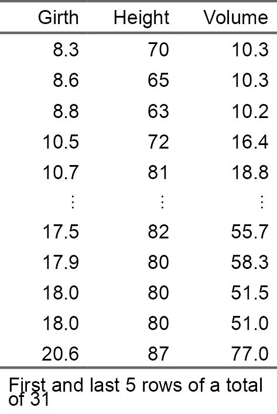
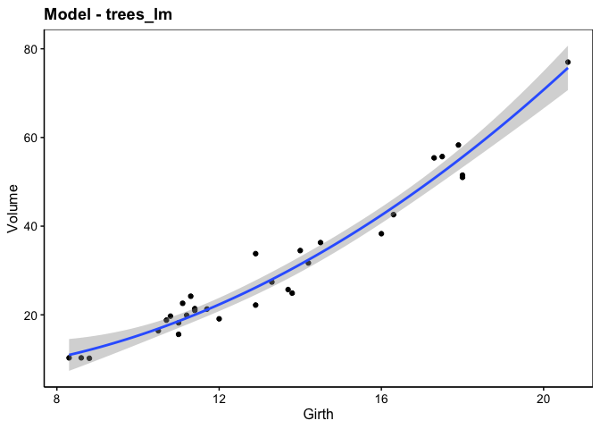
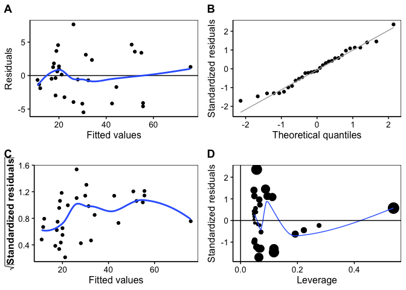

<!-- README.md is generated from README.Rmd. Please edit that file -->

# modelit - Easy data modelling with regression <a href='https://www.sciviews.org/modelit'></a>

<!-- badges: start -->

[](https://github.com/SciViews/modelit/actions/workflows/R-CMD-check.yaml)
[](https://codecov.io/gh/SciViews/modelit?branch=main)
[](https://CRAN.R-project.org/package=modelit)
[](https://www.gnu.org/licenses/gpl-2.0.html)
[](https://lifecycle.r-lib.org/articles/stages.html#experimental)

<!-- badges: end -->

The {modelit} package adds the statistical models to the SciViews::R
dialect. It uses both the `fun$type(data = ...., formula)` approach and
the enhanced formula allowing to specify arguments with `%arg=%`
directly inside the formula. It also takes the variable labels into
account in the outputs.

The {modelit} package provides methods (**lm**, **glm**; **nls**
objects) for the chart() function in the {chart} package and the
tabularise() function in the {tabularise} package. These two packages
are part of the Sciviews

## Installation

{modelit} is not available from CRAN yet. You should install it from the
[SciViews R-Universe](https://sciviews.r-universe.dev). The {chart} is
an alternate formula interface to {ggplot2}. The tabularise give
publication-ready (rich-formatted) tabular output The {equatags} package
is an optional dependency of {flextable} to manage LaTeX equations in
tables. The {data.io} package is useful too because it manages labels
and units that {chart} uses. To install those three packages and their
dependencies, run the following command in R:

``` r
install.packages(c('modelit', 'chart','tabularise', 'equatags', 'data.io'),
  repos = c('https://sciviews.r-universe.dev', 'https://cloud.r-project.org'))
```

You can also install the latest development version of {tabularise}.
Make sure you have the {remotes} R package installed:

``` r
# install.packages("remotes")
remotes::install_github("SciViews/modelit")
```

## Short example

``` r
library(chart)
library(tabularise)
library(modelit)
```

The trees datasets present diameter, height and volume for Black Cherry
Trees (*Prunus serotina*, Ehrh., 1788)

``` r
data("trees")
tabularise$headtail(trees)
```



The following model is obtained using the lm() function

``` r
trees_lm <- lm(Volume ~ Girth +I(Girth^2) + 0, data = trees)
```

the model can be viewed using the chart() function, which uses the
`trees_lm` object to produce the corresponding chart

``` r
chart(trees_lm)
```



Residuals analysis can also be carried out with chart.

``` r
chart$residuals(trees_lm)
```



For further instructions, please, refer to the help pages at
<https://www.sciviews.org/modelit/>.

## Code of Conduct

Please note that the {tabularise} package is released with a
[Contributor Code of
Conduct](https://contributor-covenant.org/version/2/1/CODE_OF_CONDUCT.html).
By contributing to this project, you agree to abide by its terms.
