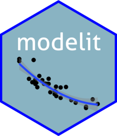

# modelit - Easy data modelling with regression <a href='https://www.sciviews.org/modelit'></a>

<!-- badges: start -->

[](https://github.com/SciViews/modelit/actions/workflows/R-CMD-check.yaml) [](https://codecov.io/gh/SciViews/modelit?branch=main) [](https://CRAN.R-project.org/package=modelit) [](https://lifecycle.r-lib.org/articles/stages.html#experimental)

<!-- badges: end -->

The {modelit} package adds the statistical models to the SciViews::R dialect. It uses both the `fun$type(data = ...., formula)` approach and the enhanced formula allowing to specify arguments with `%arg=%` directly inside the formula. It also takes the variable labels into account in the outputs.

## Installation

You can install the released version of {modelit} from [CRAN](https://CRAN.R-project.org) with (note: not yet!):

``` r
install.packages("modelit")
```

You can also install the latest development version. Make sure you have the {remotes} R package installed:

``` r
install.packages("remotes")
```

Use `install_github()` to install the {modelit} package from GitHub (source from **main** branch will be recompiled on your machine):

``` r
remotes::install_github("SciViews/modelit")
```

R should install all required dependencies automatically, and then it should compile and install {modelit}.

## Usage

You can get further help about this package this way: Make the {modelit} package available in your R session:

``` r
library(modelit)
```

Get help about this package:

``` r
library(help = "modelit")
help("modelit-package")
vignette("modelit") # None is installed with install_github()
```

For further instructions, please, refer to the help pages at <https://www.sciviews.org/modelit/>.

## Code of Conduct

Please note that the {modelit} project is released with a [Contributor Code of Conduct](https://contributor-covenant.org/version/2/0/CODE_OF_CONDUCT.html). By contributing to this project, you agree to abide by its terms.
